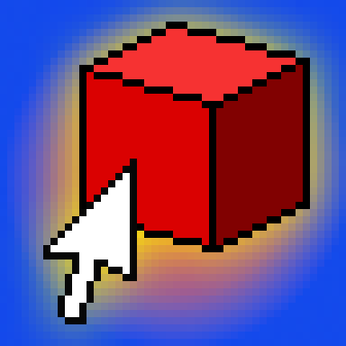

# Cube-Clicker-3DS
Port of a [Scratch game](https://scratch.mit.edu/projects/251999490) I made when I was 14

I made this game to learn the LÖVEPotion framework.

## Controls

Cube Click - A, B, X, Y, the DPAD, and the Shoulder Buttons (NOT THE TRIGGERS)

Menu Swap - Select

Save & Exit - Start

## Running

Due to how LÖVEPotion works, you need to run the game on a modded Nintendo 3DS in the Homebrew Menu. Although if you were to download the source files and run them in LÖVE2D 11.5 or later, you effectively have a PC version, although it only works with a controller.

## Acknowledgements

[LÖVE2D](https://love2d.org) - The original engine

[LÖVEPotion](https://lovebrew.org) - A fork of LÖVE2D that allows games to run on the 3DS

[nëst](https://github.com/lovebrew/nest) - Compatibility Layer for LÖVEPotion

[Lume](https://github.com/rxi/lume) - Lua functions geared towards gamedev
